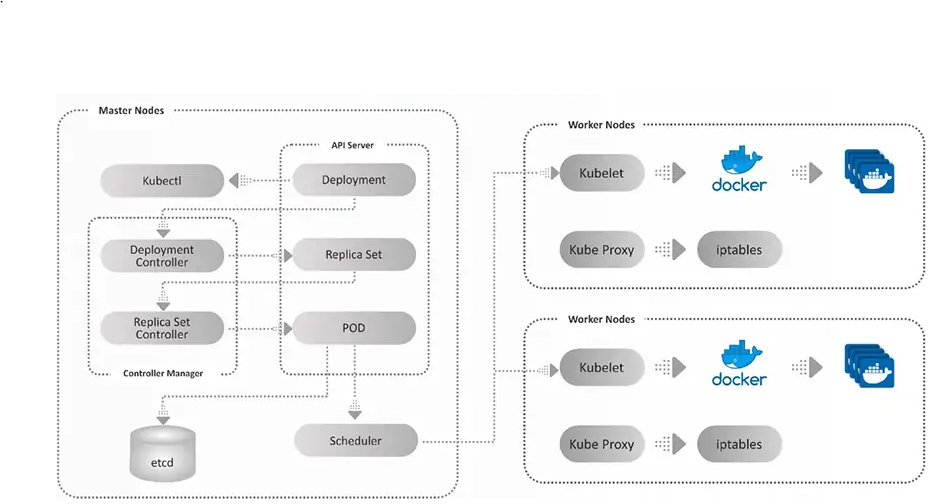

# Kubernetes-install-config

## Introduction

Kubernetes is an open source platform for managing container technologies such as Docker.

Docker lets you create containers for a pre-configured image and application. Kubernetes provides the next step, allowing you to balance loads between containers and run multiple containers across multiple systems




## Content

Kubernetes requires an existing Docker installation. Install docker on each node

- [Install & Enable docker](docker-install.md)

Install Kubernetes

- [Install Kubernetes](k8s-install.md)


Deploy Kubernetes and set the Kubernetes Cluster

- [Deploy Kubernetes & Kubernates cluster config](k8s-install.md)


## Use the Kubernetes Cluster


To start using your cluster, you need to run the following as a regular user:

```

  mkdir -p $HOME/.kube
  sudo cp -i /etc/kubernetes/admin.conf $HOME/.kube/config
  sudo chown $(id -u):$(id -g) $HOME/.kube/config

```
