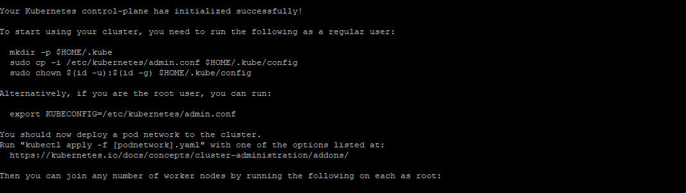
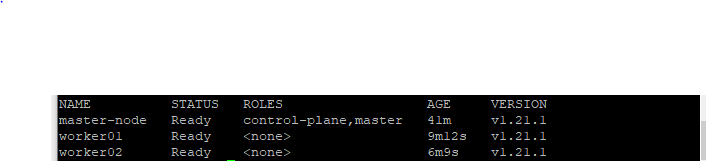

# Deploy Kubernetes


### 1. Assign Unique Hostname for Each Server Node:

Decide which server to set as the master node. Then enter the command:

```
sudo hostnamectl set-hostname master-node

```

Next, set a worker node hostname by entering the following on the worker server:

```
sudo hostnamectl set-hostname worker01

sudo hostnamectl set-hostname worker02
```


### 2. Initialize Kubernetes on Master Node:
       
Switch to the master (optional: for --apiserver-advertise-address):


```
need disable swap first:

sudo swapoff -a  

sudo kubeadm init --pod-network-cidr=192.168.0.0/16

```


Once this command finishes, it will display a kubeadm join message at the end. Make a note of the whole entry. 
This will be used to join the worker nodes to the cluster.



### 3. Create a directory for the  and user the kubernetes for non root user

To start using your cluster, you need to run the following as a regular user:


```
mkdir -p $HOME/.kube
sudo cp -i /etc/kubernetes/admin.conf $HOME/.kube/config
sudo chown $(id -u):$(id -g) $HOME/.kube/config

```

Important: You need logout and login again for non-root user use the new file for kubernetes cluster 

Alternatively, if you are the root user, you can run:

  export KUBECONFIG=/etc/kubernetes/admin.conf


### 4. Join Worker Node to Cluster
 
 As indicated in Step 2, you can enter the kubeadm join command on each worker node to connect it to the cluster.
 
 Switch to the worker01 system and enter the command you noted from Step 2:
 
``` 
 kubeadm join --discovery-token abcdef.1234567890abcdef --discovery-token-ca-cert-hash sha256:1234..cdef 1.2.3.4:6443

```
 Replace the alphanumeric codes with those from your master server. Repeat for each worker node on the cluster. Wait a few minutes; then you can check the status of the nodes.

 Switch to the master server, and enter:
 
 ```
 kubectl get nodes
``` 

At this time, the work nodes linked to master; but the status will be "Not Ready" since we don't have Pod Network yet. At here we use calico as CNI

``` 
kubectl apply -f https//docs.projectcalico.org/v3.11/manifests/calico.yaml

``` 


Let's view the node again:




 